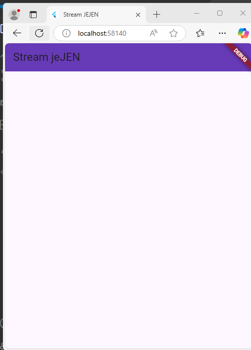
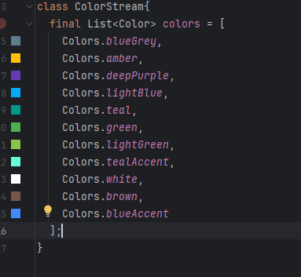
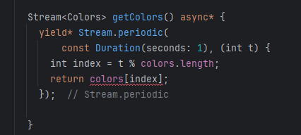
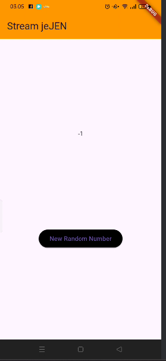
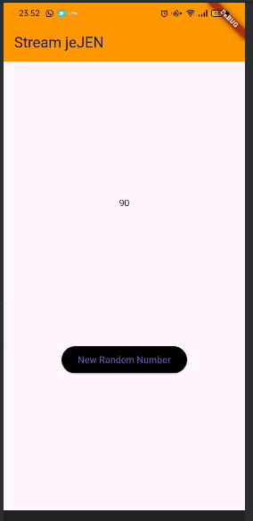

# stream_jejen

## **Praktikum 1: Dart Streams**

## Getting Started
**Soal 1**

- Tambahkan nama panggilan Anda pada title app sebagai identitas hasil pekerjaan Anda. (**done**)

- Gantilah warna tema aplikasi sesuai kesukaan Anda. (**done**)

- Lakukan commit hasil jawaban Soal 1 dengan pesan "P1: Jawaban Soal 1"

**Soal 2**

Tambahkan 5 warna lainnya sesuai keinginan Anda pada variabel colors  (**done**)

Lakukan commit hasil jawaban Soal 2 dengan pesan "P1: Jawaban Soal 2"

**Soal 3**
Jelaskan fungsi keyword yield* pada kode tersebut!

yield* digunakan untuk meneruskan stream yang dihasilkan oleh Stream.periodic ke dalam stream utama. Artinya, stream ini akan terus menghasilkan warna berdasarkan interval waktu yang sudah ditentukan.

Apa maksud isi perintah kode tersebut?

- Fungsi getColors() adalah generator stream yang mengeluarkan warna secara periodik, setiap detik, berdasarkan 
  daftar warna yang ada dalam colors.

- Stream.periodic memungkinkan pembuatan stream yang mengeluarkan nilai pada interval waktu tertentu (1 detik 
  dalam hal ini).

- Setiap detik, warna yang dihasilkan akan berputar sesuai dengan panjang array warna yang ada (menggunakan  
  modulus untuk memilih indeks).

- Fungsi ini sangat berguna jika Anda ingin memperbarui UI atau data secara berkala dalam aplikasi Flutter, 
  seperti mengubah warna latar belakang setiap detik.

Lakukan commit hasil jawaban Soal 3 dengan pesan "P1: Jawaban Soal 3"

**Soal 4**
Capture hasil praktikum Anda berupa GIF dan lampirkan di README. **done**

Lakukan commit hasil jawaban Soal 4 dengan pesan "P1: Jawaban Soal 4" **done**

**Soal 5**
Jelaskan perbedaan menggunakan listen dan await for (langkah 9) !

**listen**

.listen() adalah metode yang digunakan untuk "mendengarkan" stream dan mengeksekusi callback setiap kali stream mengeluarkan nilai baru.

**Kelebihan**:

-Tidak menghalangi jalannya eksekusi kode lainnya (non-blocking).

- Ideal ketika Anda ingin stream terus berlanjut tanpa harus menunggu secara eksplisit setiap nilai stream yang 
  diterima.

**Kekurangan**:

- Karena tidak ada mekanisme untuk menunggu atau menghentikan stream, kita tidak bisa langsung melakukan 
  tindakan lain setelah mendengarkan stream. Kode akan langsung melanjutkan eksekusi tanpa menunggu stream selesai.

- Tidak bisa menghentikan stream di tengah jalan secara langsung (diperlukan manajemen manual).

**await for**

await for adalah cara untuk menunggu dan menangani setiap nilai yang dikeluarkan oleh stream satu per satu.

**Kelebihan**:

- Menunggu setiap nilai stream secara berurutan, yang berguna jika Anda perlu 
  memproses stream secara sekuensial.

- Penanganan yang lebih jelas dan mudah untuk kasus di mana Anda memerlukan 
  tindakan berurutan untuk setiap item stream.

**Kekurangan**:

- Blocking: Ini menghalangi eksekusi program sementara Anda menunggu stream selesai, jadi jika stream tidak 
  mengeluarkan data cepat, bisa membuat UI terasa "terhenti" sementara.

- Tidak ada cara untuk berhenti mendengarkan stream lebih awal dengan cara yang langsung (berbeda dengan 
  .listen() yang memberikan kontrol lebih besar).

  Lakukan commit hasil jawaban Soal 5 dengan pesan "P1: Jawaban Soal 5" (**done**)

## **Praktikum 2: Stream controllers dan sinks**

**Soal 6**

Jelaskan maksud kode langkah 8 dan 10 tersebut!

**Pada langkah 8** kode yang digunakan ialah initState() yang digunakan untuk mendengarkan stream (numberStreamController.stream) ketika widget pertama kali diinisialisasi.

**Pada langkah 10** kode yang digunakan ialah addRandomNumber(), Pada kode ini, bertujuan untuk menambahkan data baru ke stream.

Capture hasil praktikum Anda berupa GIF dan lampirkan di README.

Lalu lakukan commit dengan pesan "P2: Jawaban Soal 6". (**done**)

**Soal 7**
Jelaskan maksud kode langkah 13 sampai 15 tersebut!

langkah ke 13

berikut masud dari kode pada langkah ke 13

pada langkah tersebut mempunyai method yang berisikan controller.sink dan addError('error')

- method controller.sink Ini adalah objek StreamController. StreamController digunakan untuk membuat dan 
  mengelola stream, serta untuk menambah data atau error ke stream.

- sink: sink adalah bagian dari StreamController yang digunakan untuk menambah data atau error ke dalam stream. 
  Sink menerima input berupa data biasa atau error yang akan disalurkan ke stream dan diterima oleh pendengar (listeners) yang terhubung dengan stream tersebut.

- addError: Ini adalah metode dari sink yang digunakan untuk mengirimkan error event ke stream. Ketika addError 
  dipanggil, stream akan mengirimkan error ke semua listener yang sedang mendengarkan stream ini. Error ini bisa berupa apa saja, biasanya berupa objek atau pesan yang menyatakan ada masalah atau kondisi error yang terjadi di dalam aliran data.

- 'error': Ini adalah parameter yang diteruskan ke addError. Dalam hal ini, parameter 'error' adalah string 
  yang menunjukkan pesan error yang ingin Anda kirimkan ke stream. Anda bisa menggantinya dengan objek lain, seperti instance dari kelas custom yang berisi detail error.

berikut masud dari kode pada langkah ke 14

- stream.listen() adalah cara untuk mulai mendengarkan event yang datang dari stream.

- Di dalam listen(), kita menyertakan callback yang akan dijalankan setiap kali ada event baru yang diterima 
  oleh stream.

- (event) adalah parameter yang mewakili data yang diterima dari stream. Setiap kali stream menghasilkan data 
  baru (melalui add() atau addError()), callback ini akan dipanggil dengan event terbaru.

berikut masud dari kode pada langkah ke 15

numberStream.addError() adalah suatu cara untuk mengirimkan error ke dalam stream menggunakan StreamController di Dart. Dengan menggunakan metode ini, Anda dapat menambahkan kesalahan (error) ke dalam stream yang sedang dipantau. Ketika error tersebut terjadi, listener yang mendengarkan stream ini akan menangani error tersebut.

Kembalikan kode seperti semula pada Langkah 15, comment addError() agar Anda dapat melanjutkan ke praktikum 3 berikutnya. **done**

Lalu lakukan commit dengan pesan "P2: Jawaban Soal 7".

berikut screenshoot hasil perubahan dari langkah 13 ke 15

## **Praktikum 3: Injeksi data ke streams**

**Soal 8**
Jelaskan maksud kode langkah 1-3 tersebut!

**langkah 1**
jelaskan dari kode late StreamTransformer transformer;

    - StreamTransformer adalah sebuah kelas yang disediakan oleh Dart untuk mengubah (transformasi) data yang 
      lewat dalam sebuah stream. Kelas ini memungkinkan kita untuk melakukan operasi tertentu terhadap data stream sebelum data tersebut diproses lebih lanjut. Dengan menggunakan StreamTransformer, kita dapat mengubah data yang datang dalam stream, misalnya dengan memetakan atau memfilter data tersebut.

    - late adalah sebuah keyword dalam Dart yang digunakan untuk menandakan bahwa variabel tersebut akan 
      diinisialisasi pada suatu waktu di kemudian hari, namun belum tentu langsung saat deklarasi. late digunakan ketika Anda yakin bahwa variabel tersebut akan diinisialisasi sebelum digunakan, tetapi tidak bisa diinisialisasi saat deklarasi. Misalnya, karena variabel ini membutuhkan nilai yang didapat dari logika lain (misalnya, dalam initState() di Flutter).

    - StreamTransformer<int, int> adalah tipe parameter untuk StreamTransformer. Ini menunjukkan bahwa stream 
      input (sebelum ditransformasi) berisi data bertipe int, dan output (setelah ditransformasi) juga akan menghasilkan data bertipe int. Dalam kasus ini, input dan output dari stream transformer adalah data integer.

**lahkah 2**

transformer = StreamTransformer<int, int>.fromHandlers(
  handleData: (value, sink) {
    sink.add(value * 10);  // Mengalikan data yang diterima dengan 10 dan mengirimkannya ke sink
  },
  handleError: (error, trace, sink) {
    sink.add(-1);  // Jika ada error, outputkan -1
  },
  handleDone: (sink) => sink.close(),  // Menutup sink setelah stream selesai
);

Penjelasan:
1. StreamTransformer<int, int>:

    - StreamTransformer<T, R> adalah kelas yang memungkinkan Anda untuk mengubah atau memproses data stream yang masuk.

    - T adalah tipe data yang diterima oleh stream (input), dan R adalah tipe data yang akan dihasilkan oleh stream (output).

    - Dalam kode ini, T dan R keduanya adalah int. Ini berarti bahwa input dan output stream akan berupa integer.

2. fromHandlers:
    - fromHandlers adalah sebuah metode untuk membuat StreamTransformer dari beberapa handler (penangan data, error, dan selesai).

    - Dalam hal ini, kita membuat handler untuk menangani data, error, dan kapan stream selesai.

3. handleData:

    - handleData: (value, sink) adalah callback yang dipanggil setiap kali data baru diterima dari stream.

    - value adalah data yang diterima dari stream.

    - sink.add(value * 10): Setiap nilai yang diterima akan dikalikan dengan 10, dan kemudian dikirimkan 
      (ditambahkan) ke sink. sink adalah tempat di mana data yang diproses akan dikirimkan ke penerima stream selanjutnya.

    - Misalnya, jika stream menerima nilai 2, maka nilai yang dikirimkan setelah transformasi 
      adalah 2 * 10 = 20.

4. handleError:

    - handleError: (error, trace, sink) adalah callback yang dipanggil jika terjadi error dalam stream.

    - sink.add(-1): Jika terjadi error, kita mengirimkan nilai -1 ke sink untuk menunjukkan bahwa ada masalah. 
      Dalam hal ini, data -1 akan diteruskan ke penerima stream selanjutnya.

    - error adalah objek error yang terjadi, dan trace adalah jejak stack error tersebut.

5. handleDone:

    - handleDone: (sink) => sink.close() adalah callback yang dipanggil ketika stream selesai dan tidak ada 
      data lagi yang akan diterima.

    - sink.close() menandakan bahwa stream selesai, dan sink (output stream) akan ditutup.

**lahkah 3**

penjelasan kode berikut 

stream
        .transform(transformer)
        .listen(
            (event){
      setState(() {
        lastNumber = event;
      });
    }).onError((error){
      setState(() {
        lastNumber = -1;
      });
    });

    super.initState();

1. stream:

    - Ini adalah sebuah objek Stream. Sebuah stream adalah urutan event/data yang dapat diteruskan secara 
      asinkron ke dalam aplikasi Anda.

    - Dalam kode ini, stream bisa jadi stream yang sudah ada sebelumnya (misalnya, sebuah stream yang 
      mengalirkan data atau angka).

2. .transform(transformer):

    - transform(transformer) adalah sebuah metode yang mengubah aliran data dari stream menggunakan sebuah 
      StreamTransformer.

    - transformer adalah objek StreamTransformer yang digunakan untuk memodifikasi data yang lewat di stream. 
      Misalnya, setiap data yang diterima dari stream akan diproses terlebih dahulu menggunakan transformer, seperti mengalikan nilai atau melakukan operasi lain pada data sebelum data itu diteruskan ke penerima berikutnya.

    - Pada kode sebelumnya, transformer yang digunakan adalah sebuah transformer yang mengalikan 
      nilai dengan 10.

3. .listen(event)

    - listen adalah metode yang digunakan untuk mulai mendengarkan (atau menerima) data yang datang dari stream.

    - Parameter pertama pada listen adalah callback yang menangani data yang diterima. Setiap kali data baru 
      diterima, callback ini akan dipanggil.

    - (event) mewakili data yang diterima dari stream setelah diproses oleh transformer. Data ini bisa berupa 
      nilai yang sudah dimodifikasi, seperti nilai yang dikalikan dengan 10 dalam contoh sebelumnya.

    - setState(() { lastNumber = event; }): Ini adalah cara untuk memperbarui state dalam widget. Ketika data 
      baru diterima, nilai lastNumber akan diubah dan UI akan diperbarui dengan nilai yang baru.

4. .onError(error)

    - onError adalah callback yang dipanggil jika terjadi error dalam stream. Artinya, jika stream mengalami 
      masalah atau error, callback ini akan menangani error tersebut.

    - (error) adalah objek error yang terjadi pada stream.

    - Dalam kode ini, jika ada error, setState(() { lastNumber = -1; }) akan dipanggil, yang berarti UI akan 
      diperbarui untuk menunjukkan nilai -1 sebagai tanda ada kesalahan.

5. super.initState();

    - Baris ini memanggil initState() dari superclass (dalam hal ini, State dari widget). initState() adalah 
      metode yang dipanggil saat state pertama kali diinisialisasi dan biasanya digunakan untuk menyiapkan stream atau melakukan pengaturan awal.

    - Biasanya, super.initState() harus dipanggil di dalam initState() untuk memastikan bahwa setup dasar dari 
      state dilakukan dengan benar.

Capture hasil praktikum Anda berupa GIF dan lampirkan di README.
Lalu lakukan commit dengan pesan "P3: Jawaban Soal 8".

