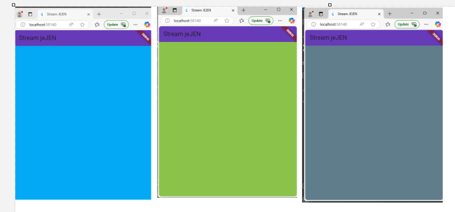

# stream_jejen

## **Praktikum 1: Dart Streams**

## Getting Started
**Soal 1**

- Tambahkan nama panggilan Anda pada title app sebagai identitas hasil pekerjaan Anda. (**done**)

- Gantilah warna tema aplikasi sesuai kesukaan Anda. (**done**)

- Lakukan commit hasil jawaban Soal 1 dengan pesan "P1: Jawaban Soal 1"

**Soal 2**

Tambahkan 5 warna lainnya sesuai keinginan Anda pada variabel colors  (**done**)

Lakukan commit hasil jawaban Soal 2 dengan pesan "P1: Jawaban Soal 2"

**Soal 3**
Jelaskan fungsi keyword yield* pada kode tersebut!

yield* digunakan untuk meneruskan stream yang dihasilkan oleh Stream.periodic ke dalam stream utama. Artinya, stream ini akan terus menghasilkan warna berdasarkan interval waktu yang sudah ditentukan.

Apa maksud isi perintah kode tersebut?

- Fungsi getColors() adalah generator stream yang mengeluarkan warna secara periodik, setiap detik, berdasarkan 
  daftar warna yang ada dalam colors.

- Stream.periodic memungkinkan pembuatan stream yang mengeluarkan nilai pada interval waktu tertentu (1 detik 
  dalam hal ini).

- Setiap detik, warna yang dihasilkan akan berputar sesuai dengan panjang array warna yang ada (menggunakan  
  modulus untuk memilih indeks).

- Fungsi ini sangat berguna jika Anda ingin memperbarui UI atau data secara berkala dalam aplikasi Flutter, 
  seperti mengubah warna latar belakang setiap detik.

Lakukan commit hasil jawaban Soal 3 dengan pesan "P1: Jawaban Soal 3"

**Soal 4**
Capture hasil praktikum Anda berupa GIF dan lampirkan di README. **done**

Lakukan commit hasil jawaban Soal 4 dengan pesan "P1: Jawaban Soal 4" **done**

**Soal 5**
Jelaskan perbedaan menggunakan listen dan await for (langkah 9) !

**listen**

.listen() adalah metode yang digunakan untuk "mendengarkan" stream dan mengeksekusi callback setiap kali stream mengeluarkan nilai baru.

**Kelebihan**:

-Tidak menghalangi jalannya eksekusi kode lainnya (non-blocking).

- Ideal ketika Anda ingin stream terus berlanjut tanpa harus menunggu secara eksplisit setiap nilai stream yang 
  diterima.

**Kekurangan**:

- Karena tidak ada mekanisme untuk menunggu atau menghentikan stream, kita tidak bisa langsung melakukan 
  tindakan lain setelah mendengarkan stream. Kode akan langsung melanjutkan eksekusi tanpa menunggu stream selesai.

- Tidak bisa menghentikan stream di tengah jalan secara langsung (diperlukan manajemen manual).

**await for**

await for adalah cara untuk menunggu dan menangani setiap nilai yang dikeluarkan oleh stream satu per satu.

**Kelebihan**:

- Menunggu setiap nilai stream secara berurutan, yang berguna jika Anda perlu 
  memproses stream secara sekuensial.

- Penanganan yang lebih jelas dan mudah untuk kasus di mana Anda memerlukan 
  tindakan berurutan untuk setiap item stream.

**Kekurangan**:

- Blocking: Ini menghalangi eksekusi program sementara Anda menunggu stream selesai, jadi jika stream tidak 
  mengeluarkan data cepat, bisa membuat UI terasa "terhenti" sementara.

- Tidak ada cara untuk berhenti mendengarkan stream lebih awal dengan cara yang langsung (berbeda dengan 
  .listen() yang memberikan kontrol lebih besar).

  Lakukan commit hasil jawaban Soal 5 dengan pesan "P1: Jawaban Soal 5" (**done**)

## **Praktikum 2: Stream controllers dan sinks**

**Soal 6**

Jelaskan maksud kode langkah 8 dan 10 tersebut!

**Pada langkah 8** kode yang digunakan ialah initState() yang digunakan untuk mendengarkan stream (numberStreamController.stream) ketika widget pertama kali diinisialisasi.

**Pada langkah 10** kode yang digunakan ialah addRandomNumber(), Pada kode ini, bertujuan untuk menambahkan data baru ke stream.

Capture hasil praktikum Anda berupa GIF dan lampirkan di README.

Lalu lakukan commit dengan pesan "P2: Jawaban Soal 6". (**done**)

**Soal 7**
Jelaskan maksud kode langkah 13 sampai 15 tersebut!

langkah ke 13

berikut masud dari kode pada langkah ke 13

pada langkah tersebut mempunyai method yang berisikan controller.sink dan addError('error')

- method controller.sink Ini adalah objek StreamController. StreamController digunakan untuk membuat dan 
  mengelola stream, serta untuk menambah data atau error ke stream.

- sink: sink adalah bagian dari StreamController yang digunakan untuk menambah data atau error ke dalam stream. 
  Sink menerima input berupa data biasa atau error yang akan disalurkan ke stream dan diterima oleh pendengar (listeners) yang terhubung dengan stream tersebut.

- addError: Ini adalah metode dari sink yang digunakan untuk mengirimkan error event ke stream. Ketika addError 
  dipanggil, stream akan mengirimkan error ke semua listener yang sedang mendengarkan stream ini. Error ini bisa berupa apa saja, biasanya berupa objek atau pesan yang menyatakan ada masalah atau kondisi error yang terjadi di dalam aliran data.

- 'error': Ini adalah parameter yang diteruskan ke addError. Dalam hal ini, parameter 'error' adalah string 
  yang menunjukkan pesan error yang ingin Anda kirimkan ke stream. Anda bisa menggantinya dengan objek lain, seperti instance dari kelas custom yang berisi detail error.

berikut masud dari kode pada langkah ke 14

- stream.listen() adalah cara untuk mulai mendengarkan event yang datang dari stream.

- Di dalam listen(), kita menyertakan callback yang akan dijalankan setiap kali ada event baru yang diterima 
  oleh stream.

- (event) adalah parameter yang mewakili data yang diterima dari stream. Setiap kali stream menghasilkan data 
  baru (melalui add() atau addError()), callback ini akan dipanggil dengan event terbaru.

berikut masud dari kode pada langkah ke 15

numberStream.addError() adalah suatu cara untuk mengirimkan error ke dalam stream menggunakan StreamController di Dart. Dengan menggunakan metode ini, Anda dapat menambahkan kesalahan (error) ke dalam stream yang sedang dipantau. Ketika error tersebut terjadi, listener yang mendengarkan stream ini akan menangani error tersebut.

Kembalikan kode seperti semula pada Langkah 15, comment addError() agar Anda dapat melanjutkan ke praktikum 3 berikutnya. **done**

Lalu lakukan commit dengan pesan "P2: Jawaban Soal 7".

